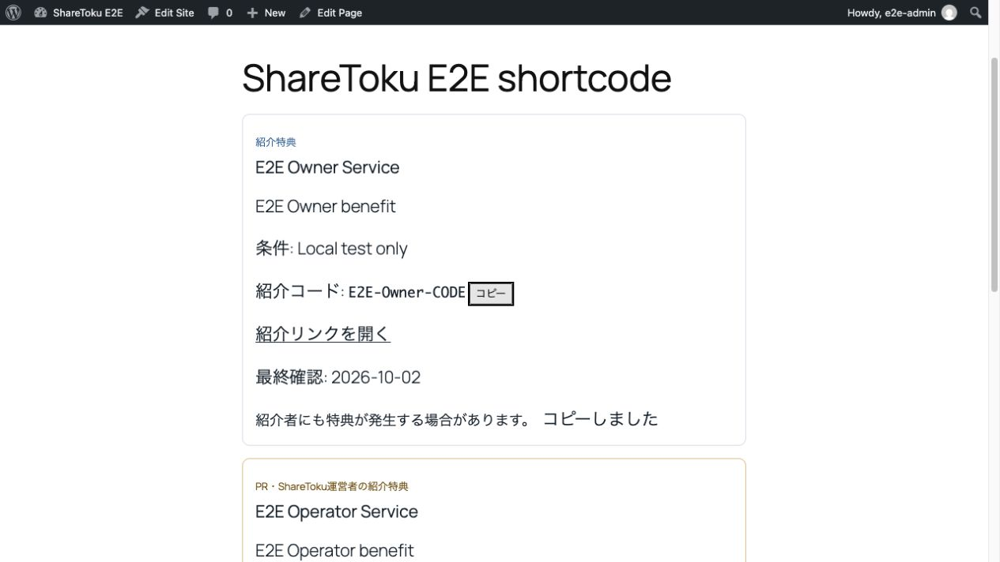

# 実WordPress検証記録（#26、2026-10-03 JST）

対象製品コード: main `532a1003e2295c544ced223550961f9123e9a628`。一般公開Gateは未承認。

WordPress 7.1.2（公式配布）、PHP 8.5.9、MySQL 8.0.46。実プラグインと実Laravel APIを、loopback限定の隔離環境で接続した。架空データのみを使い、本番APP_KEY、Google秘密情報、Site Token、利用者データは流用していない。

SaaS: `http://localhost:8000`、WordPress: `http://127.0.0.1:8767`。Laravel DBは`sharetoku_laravel_e2e`、WP DBは`sharetoku_wp_e2e`。TTLは試験用に10秒。本番のHTTPS・代表ドメイン・既定300秒TTLでの確認は別途必要。

## 実施結果

| 検証 | 方法 | 実測 |
| --- | --- | --- |
| PKCE / callback / exchange | 実ブラウザーでWP「接続」→SaaS確認→WP callback | 接続済み、Site / Plan free表示 |
| FREE match | 実ブラウザー、実WP shortcode / API | 本人1、別サービスの運営者1、明示PR表示 |
| no match | 実ブラウザーとWP-CLI実レンダラー | 本人1、運営者0 |
| 同意撤回 | fresh API / WP-CLI、実ブラウザー | 本人1、運営者0 |
| PRO | fresh API / WP-CLI、実ブラウザー | 本人1、運営者0 |
| Offer停止 / Program inactive | WP-CLI実レンダラー、実API | 本人0、運営者0 |
| Site停止 | WP-CLI実レンダラー、実API | 本人0、運営者0 |
| global kill switch OFF | WP-CLI実レンダラー、実API | 本人1、運営者0 |
| kill switchとTTL | cacheを消さず、直後と11秒待機後に実レンダラーを実行 | 直後1/1、期限後1/0。10秒TTLを使用 |
| API停止 | Laravel serverを停止し、cache削除なしで実レンダラーを実行 | fresh時1/1、11秒待機後0/0 |
| API停止後のWP本文 | 実ブラウザーで期限後にreload | タイトル・ナビゲーション・footer正常、特典なし |
| 実WP REST検索 | WP-CLIから登録済みREST routeをnonce付きdispatch | 200、本人Offerが検索結果に存在 |
| FREE / PRO preview | 実WP REST→実API（fresh cache） | 1/1、1/0。previewのevent tokenは空 |
| 接続解除→再接続 | 実ブラウザーの接続解除とPKCE callback | 未接続→接続済み。DBのTokenは2件中1失効・1有効 |
| コピー / 外部リンク属性 | 実ブラウザー | 「コピーしました」。本人・運営者リンクにnofollow sponsored noopener noreferrer |

状態変更は隔離DBのfixture操作で行った。Googleログイン、Offer作成、reviewer承認、Site作成、FREE同意操作のブラウザー完走を意味しない。通常のWordPress core、transient、HTTP client、REST callback、プラグインレンダラーを使っており、API応答やWP関数のstubは使っていない。



## 残る受け入れ確認

- HTTPSの代表ドメイン、実Googleログイン→作成→別reviewer承認の一連のブラウザー操作。今回は両サービスとも隔離環境限定の認証fixtureを使用した。そのテスト用認証コードは製品コード・このPRに含めない。
- 実Gutenbergで検索→選択→保存→再編集。ブロックは挿入一覧に出て挿入できたが、このブラウザーではblob URLの編集canvasが空となった。原因を製品の不具合とは断定していない。REST検索・preview成功で代替完了扱いにしない。
- impression / clickのブラウザー送信→DB記録→集計。今回ブラウザー表示後のanalytics_eventsは0件で、送信完了は確認できていない。API受信単体テストの成功と区別する。
- コピー後の実際の貼り付け内容。ブラウザーのコピー成功表示を確認したが、ツールのclipboard読み取りは空であった。
- 外部リンクの遷移先、スマホの実画面、ポータルの公開撤回・404・コピー後貼り付け。
- Offer / Program / Site停止それぞれのcache削除なしTTL試験。本記録の停止3条件はfresh応答で確認した。TTL前後を実測したのはkill switchとAPI停止。

## 再実行

公式WordPress / WP-CLIを使い、空の専用MySQL DBにLaravel migrationを適用する。`APP_ENV=local`、独自APP_KEY、上記専用DB名、mail/logの安全な設定、loopback HTTP serverを使用する。production config cacheをコピーしない。

1. `php tests/manual/wordpress-fixture-seed.php > /tmp/sharetoku-e2e-fixture.json`。seedはlocal・MySQL・専用DB名・Userなしを確認してから作成する。
2. JSONのoperator_workspaceを`SHARETOKU_OPERATOR_WORKSPACE_PUBLIC_ID`へ設定し、`SHARETOKU_OPERATOR_OFFERS_ENABLED=true`、`SHARETOKU_CACHE_TTL=10`を設定する。WPにmainのプラグインを入れて有効化する。
3. WP設定にAPI URLとJSONのsiteを設定し、認証済みのWorkspace管理者として実PKCE接続を行う。`[sharetoku offer="JSONのoffers.owner" placement="e2e-shortcode"]`を配置する。
4. 各状態を`php tests/manual/wordpress-fixture-state.php baseline`などで設定し、実レンダラーを実行する。fixture helperは認可・失効操作自体のテストではなく、表示条件の再現用。

```sh
SHARETOKU_E2E_CLEAR_CACHE=1 SHARETOKU_E2E_EXPECT=1,1 \
php /path/to/wp-cli.phar eval-file /path/to/repo/tests/manual/wordpress-render-check.php --path=/path/to/wordpress

SHARETOKU_E2E_CLEAR_CACHE=1 SHARETOKU_E2E_EXPECT=1,1 \
php /path/to/wp-cli.phar eval-file /path/to/repo/tests/manual/wordpress-rest-check.php --path=/path/to/wordpress
```

`SHARETOKU_E2E_FIXTURE`でJSONの場所を変更できる。状態: baseline、no-match、withdrawn、pro、offer-off、program-off、site-off、kill-off。期待値は表の本人/運営者件数。WP helperも専用DB名を確認してから動く。TTL試験では初回だけcacheを削除し、変更直後と期限後に`CLEAR_CACHE`なしで検証する。API停止試験もcacheを消さない。最後にbaselineへ戻す。

これらは手動環境検証用であり、通常CIでWPの未インストール環境に対して実行しない。秘密TokenやHTML内のevent tokenを検証出力へ書き出さない。
